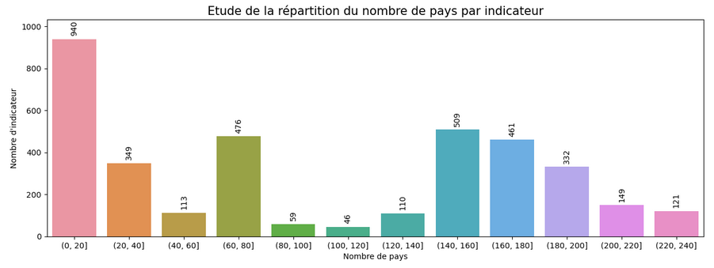
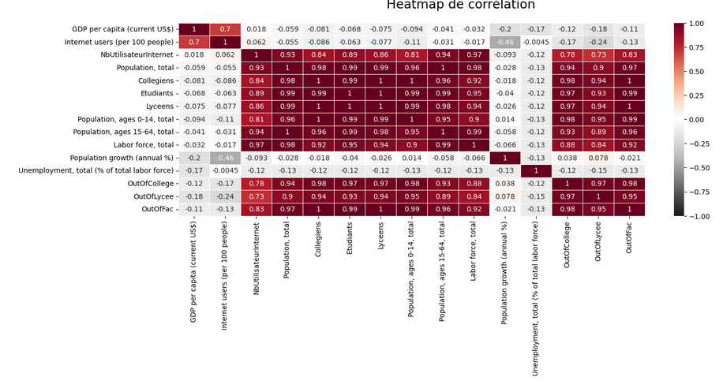
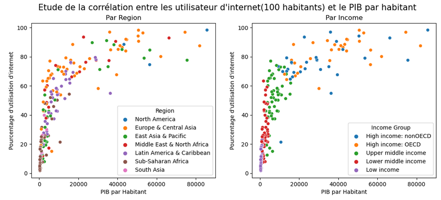
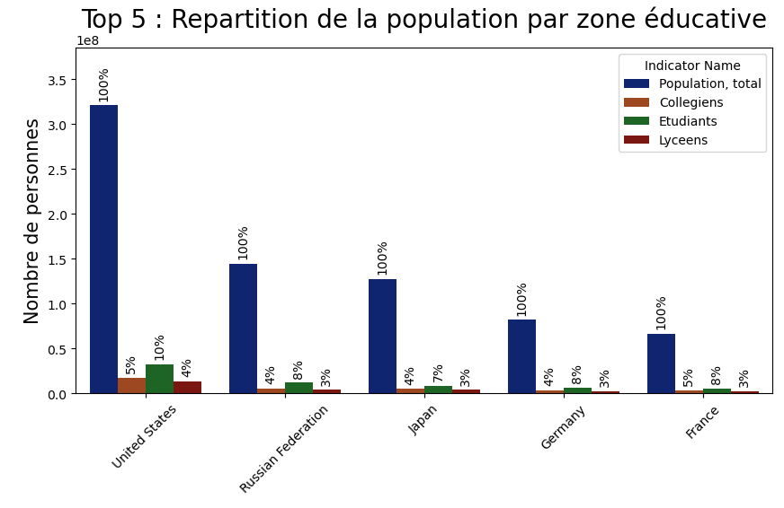

# 📊 Projet N°1 : Analyse des données de systèmes éducatifs  

  

## **📌 Contexte et Objectif**  

L'entreprise **Academy**, spécialisée dans la formation en ligne pour lycéens et étudiants, souhaite **identifier les pays à fort potentiel pour son expansion**.  

### 🔍 **Problématiques étudiées :**  
- Quels sont les pays ayant **le plus grand nombre de clients potentiels** ?  
- Quelle sera **l’évolution de ce marché** dans les années à venir ?  
- **Dans quels pays** Academy devrait-elle se lancer en priorité ?  

📂 **Jeux de données :**  
- 📊 Source : [Banque mondiale - Education Statistics](https://datacatalog.worldbank.org/dataset/education-statistics)  
- 📥 [Téléchargement direct du dataset](https://s3-eu-west-1.amazonaws.com/static.oc-static.com/prod/courses/files/Parcours_data_scientist/Projet+-+Donn%C3%A9es+%C3%A9ducatives/Projet+Python_Dataset_Edstats_csv.zip)  

---

## **🚀 Réalisations et Méthodologie**  

### 🔹 **1️⃣ Chargement et Exploration des données**  
- Vérification des fichiers et des colonnes disponibles  
- Identification des valeurs manquantes et doublons  
- Étude des types de données et pertinence des indicateurs  

### 🔹 **2️⃣ Nettoyage et Préparation des données**  
- Sélection des colonnes les plus utiles  
- Fusion des fichiers après nettoyage  
- Traitement des valeurs aberrantes  

### 🔹 **3️⃣ Analyse et Visualisation**  
- Étude des tendances globales et régionales  
- Analyse comparative des indicateurs éducatifs et économiques  
- Création de graphiques pour illustrer les résultats  

📊 **Exemples de visualisations :**  

  
  
  
  
  

---

## **📈 Résultats et Insights Clés**  

### 🔎 **Conclusions de l'analyse :**  
✔ Certains pays présentent **un fort taux d’inscription** et un **investissement croissant** dans l’éducation.  
✔ Les tendances démographiques montrent que **[Nom des régions]** seront des zones stratégiques pour Academy.  
✔ Certains pays nécessitent **une meilleure couverture des données** pour une analyse plus fiable.  

### 📌 **Recommandations pour Academy :**  
1️⃣ Cibler **[Nom des pays]** pour une première expansion.  
2️⃣ Surveiller l'évolution des inscriptions dans **[Autres régions]**.  
3️⃣ Améliorer la collecte et la qualité des données pour affiner les prévisions.  

---

## **🛠️ Technologies et Outils Utilisés**  

- **Langage** : Python 🐍  
- **Librairies** : Pandas, NumPy, Matplotlib, Seaborn, Scikit-learn  
- **Environnement** : Jupyter Notebook  
- **Méthodes utilisées** : Statistiques descriptives, Data Visualization, Data Cleaning  

---

## **📬 Contact et Feedback**  

💡 Ce projet a été réalisé dans le cadre d’une **formation en Data Science**. N’hésitez pas à **laisser vos suggestions** ou à me **contacter** pour en discuter !  

📩 **Contact :**  
📧 [Votre Email]  
🔗 [Votre LinkedIn]  

---

✅ **Mise à jour** : Version optimisée pour une meilleure lisibilité et clarté (📅 Février 2025)  

